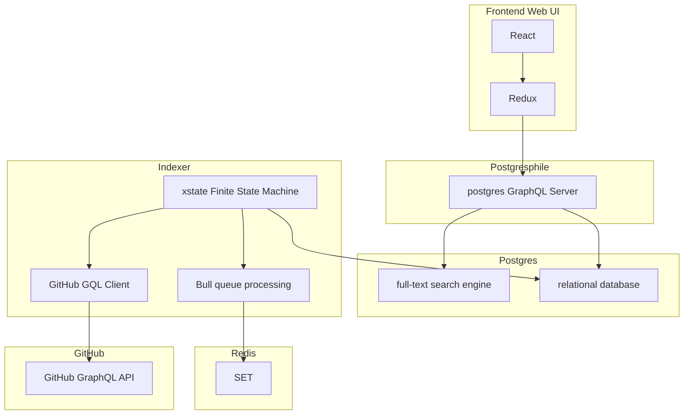

# GitHub Full-Text Comment Search

## Getting Started

```
# Install `bun` globally
npm i -g bun

# Install bun dependencies
bun install

# Start everything
bun up
# (may need to restart after initial DB start)
```

### Starting service(s)
```
bun up [service]
```

### Stopping service(s)
```
# Stop everything
bun  down

# OR a specific service
bun stop <service>
```

## Documentation

See the [`./docs`](./docs) directory.

## Database Migrations

Database migrations are facilitated by [graphile-migrate](https://github.com/graphile/migrate)

```
bun migrate <command>
```
(see: [`graphile-migrate` CLI usage](https://github.com/graphile/migrate#graphile-migrate-1))

## Architecture


