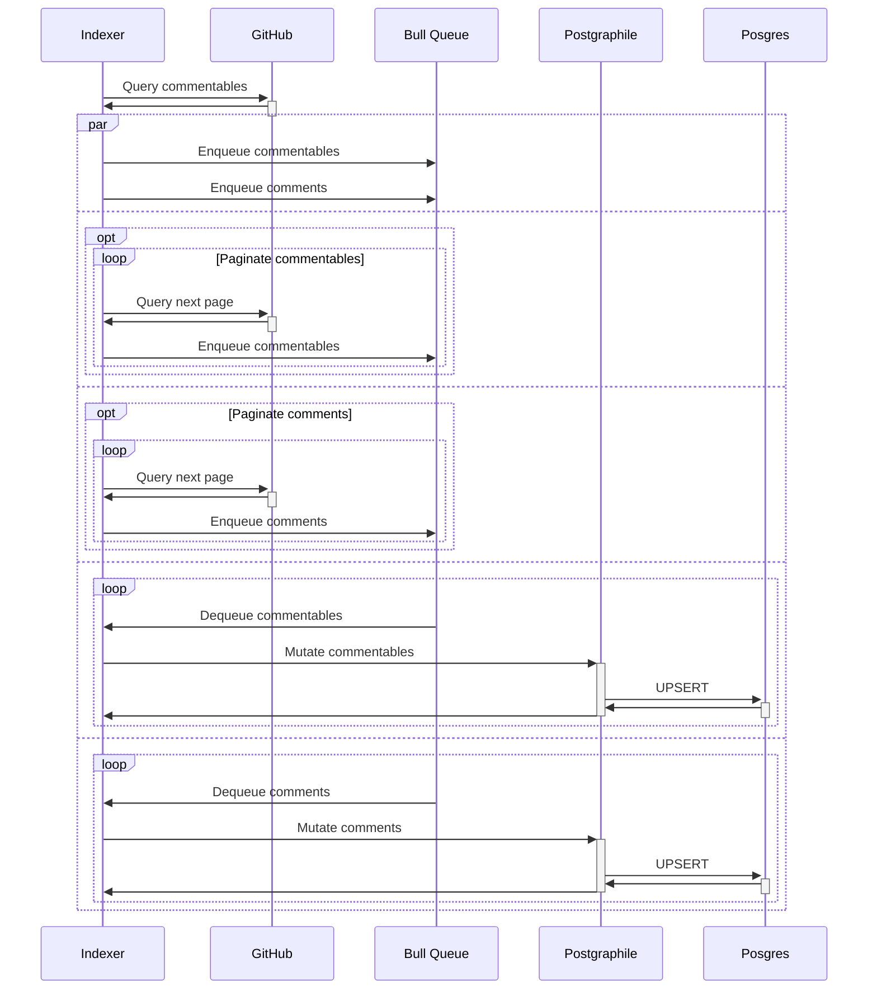

# Indexer

## Sequence Diagram

```mermaid
sequenceDiagram
    participant idx as Indexer
    participant gh as GitHub
    participant bl as Bull Queue
    participant gq as Postgraphile
    participant pg as Posgres

    
    idx ->>+ gh: Query commentables
    gh ->>- idx: 


    par
        idx ->> bl: Enqueue commentables
        idx ->> bl: Enqueue comments

        and 
        opt
            loop Paginate commentables
                idx ->>+ gh: Query next page
                gh ->>- idx: 
                idx ->> bl: Enqueue commentables
            end
        end

        and
        opt Paginate comments
            loop
                idx ->>+ gh: Query next page
                gh ->>- idx: 
                idx ->> bl: Enqueue comments
            end
        end

        and
        loop
            bl ->> idx: Dequeue commentables
            idx ->>+ gq: Mutate commentables
            gq ->>+ pg: UPSERT
            pg ->>- gq: 
            gq ->>- idx: 
        end
        
        and
        loop
            bl ->> idx: Dequeue comments
            idx ->>+ gq: Mutate comments
            gq ->>+ pg: UPSERT
            pg ->>- gq: 
            gq ->>- idx: 
        end
    end
```