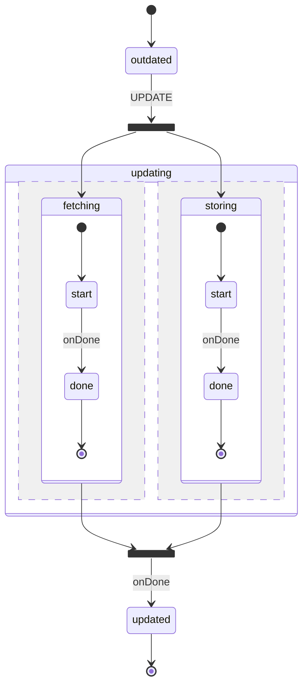

# [`xstate`](https://xstate.js.org/docs/) Finite State Machine

## State Diagram

```mermaid
stateDiagram
     [*] --> outdated

    state parallel_fork <<fork>>
    state parallel_join <<join>>

    outdated --> parallel_fork : UPDATE
    parallel_fork --> fetching
    parallel_fork --> storing

    state updating {
        state fetching {
            state "start" as q_start
            state "done" as q_done
            [*] --> q_start
            q_start --> q_done : onDone
            q_done --> [*]
        }
        --

        state storing {
            state "start" as u_start
            state "done" as u_done
            
            [*] --> u_start
            u_start --> u_done : onDone
            u_done --> [*]
        }
    }

    fetching --> parallel_join
    storing --> parallel_join

    parallel_join --> updated: onDone
    updated --> [*]
```